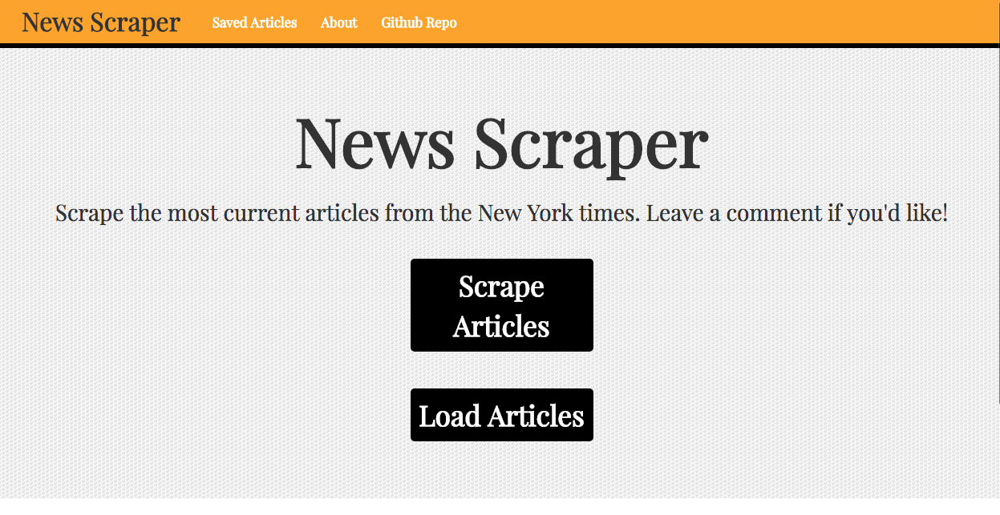

# news-scraper

An application that scrapes news articles from a given website and allows users to leave comments on individual article posts.
This web app utilizes the New York Times API to gather the most recent world news articles and allows a user to comment.

## Technologies used:

- HTML
- CSS
- Javascript
- Node JS
- MySQL
- jQuery

## NPM Packages used:

- body-parser
- express
- express-handlebars
- mysql
- method-override

## Version

1.0

## Usage

#### This is the initial landing page. The user first clicks the Scrape Articles button to load the articles from the New York Times API.

#### Next, the user clicks the Load Articles button to display the most recent articles. They are shown one at a time.

#### When the user clicks comment, a comment box appears that will accept the users entry

#### And display it above the comment box attached to that article.

### Link to the live site

https://news--scraper.herokuapp.com/
